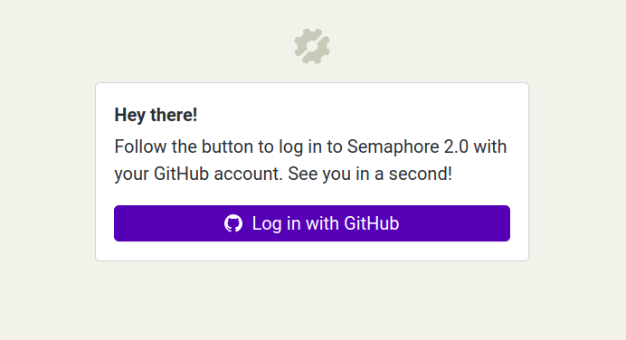
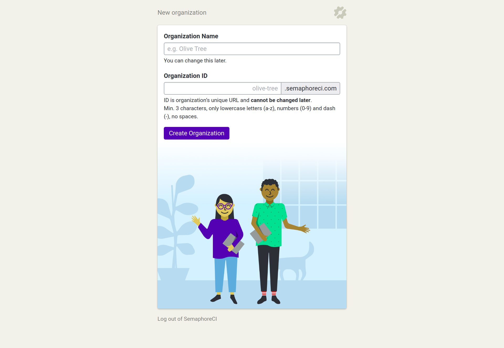
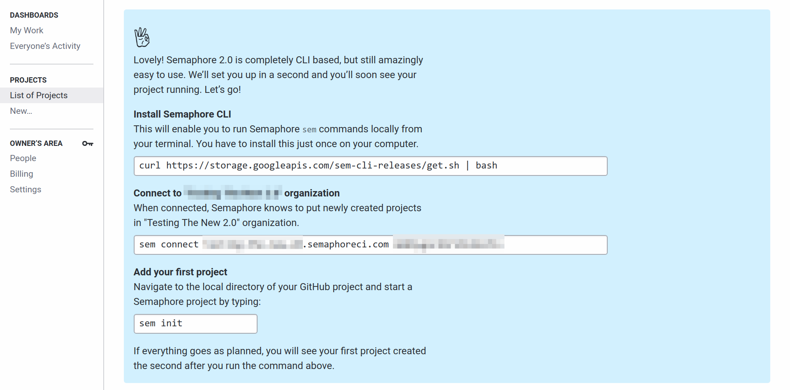
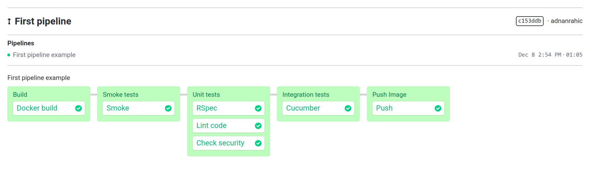
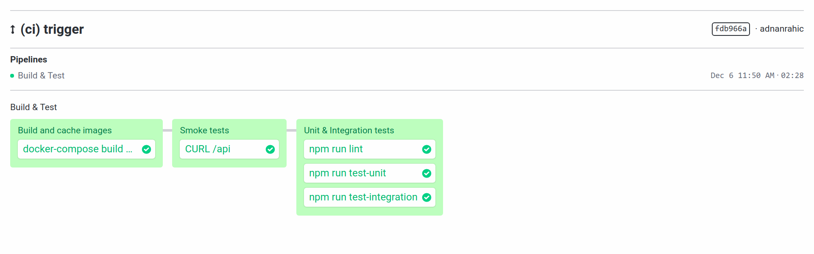
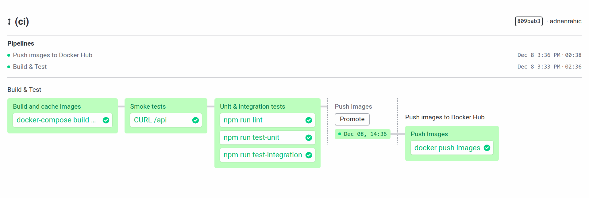
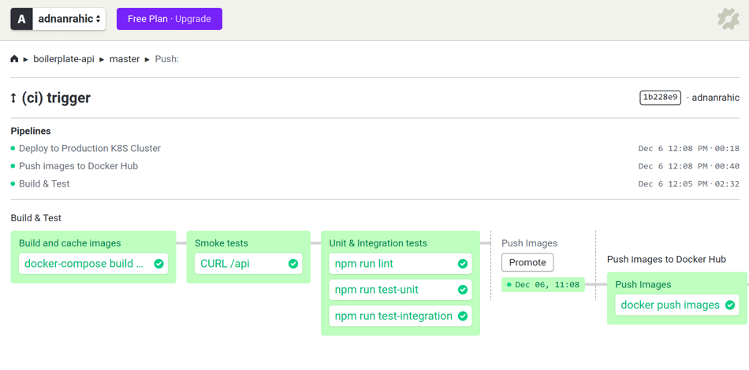
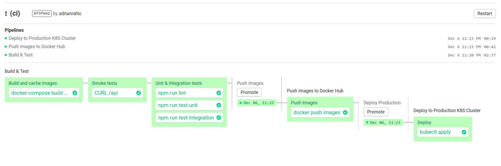

# Implementing a production-grade CI/CD pipeline with Semaphore2.0 and Kubernetes

While developing software, you tend to have a set of guidelines, familiar to you, when building features locally and running builds. Linting your code and running tests fall into this category as well. All of this lets you take your mind off repetitive tasks and focus on what's important. Writing business logic and creating value.

Doing all of this by hand, manually, is fine if you're alone. If you try doing this in a team you won't have a nice time. It also raises the issue of having to dedicate team members to make sure all tests and builds succeed. That's another stress you don't need. Be lazy instead. Everything that can be automated, should be.

## What we're building

This article will show you how to build a production-ready CI/CD pipeline, by using a simple multi-container application that works with [Docker Compose](https://docs.docker.com/compose/). I'll start slow and first explain the application, how it works, how to run the tests and build the Docker images. Once that's covered I'll move on to the Kubernetes setup, where I'll show how to create a cluster on AWS with [KOPS](https://github.com/kubernetes/kops), and deploy the containers with [Kompose](http://kompose.io/).

I'm going to assume you have an AWS account, the [AWS CLI](https://aws.amazon.com/cli/) installed on your machine, and credentials set up. But also make sure to [have Kubectl installed](https://kubernetes.io/docs/tasks/tools/install-kubectl/) as well. If you've never heard of KOPS, that's fine. [Here](https://github.com/kubernetes/kops#installing) are the install instructions.

The bulk of this walkthrough will cover the benefits of having a CI/CD pipeline and setting up a production-ready workflow with [Semaphore2.0](https://id.semaphoreci.com). The pipeline itself will automate everything you need. Once you push a new version of your application to GitHub, a webhook will trigger Semaphore2.0, and the pipeline will spring to life! The end goal is for it to build the Docker images, run all tests, push the images to Docker Hub and finally deploy everything to your cluster. But, it should only deploy automatically from the `master` branch.

Sounds fun, let's jump in!

## Step 1 - Get to know the multi-container system

The [system as a whole](https://github.com/adnanrahic/boilerplate-api) has has 3 distinct containers. First of all, a MongoDB database for persistent storage, then a Node.js API and an Nginx front end for serving HTML pages. It's configured with Docker Compose so all containers communicate between each other through networks. The MongoDB container will have a volume for persisting data even if the container is destroyed. 

I tend to say, _the easiest way to learn is to follow along_, and today is not different. [Fork the repo](https://github.com/adnanrahic/boilerplate-api), clone the fork to your local machine and tag along.

### Build and test locally

What would a regular day look while developing features for a code base like this? Well, once you're done with a task, you'd most likely first just run *ye olde* smoke test. Run everything and CURL the endpoint to make sure it works. I did make it a bit easier by creating a tiny [bash script](https://github.com/adnanrahic/boilerplate-api/blob/master/smoke_test.sh). 

To build the app you'll use a `docker-compose.yml` file. Here's the one from the repo.

```yaml
# docker-compose.yml
version: "3"
services:
  mongo:
    image: mongo:4.0
    volumes:
      - mongo:/data/db
    networks: 
      backend:
        aliases:
          - mongo
    ports:
      - "27017"
  
  api:
    build:
      context: ./
      dockerfile: Dockerfile
    image: "${API_IMAGE}:${TAG}"
    networks: 
      backend:
        aliases:
          - api
      frontend:
        aliases:
          - api 
    depends_on:
      - mongo
    ports:
      - "3000:3000"

  client:
    build:
      context: ./client
      dockerfile: Dockerfile
    image: "${CLIENT_IMAGE}:${TAG}"
    networks: 
      - frontend
    depends_on:
      - api
    ports:
      - "80:80"

networks: 
  backend:
  frontend:

volumes:
  mongo:
```

As you can see it takes three environment variables as values for the images. Luckily, Docker Compose can use an `.env` file to import environment variables. Here's what the `.env` should like. Keep in mind, you need to keep it in the root of your project.

```
SECRET=secretkey
NODE_ENV=dev
DB=mongodb://mongo:27017/boilerplate_api
PORT=3000
API_IMAGE=<username/api_image>
CLIENT_IMAGE=<username/client_image>
TAG=latest
```

_**Note**: Make sure to add this file to the `.gitignore`._

Where `<username/api_image>` and `<username/client_image>` are placeholders for your Docker Hub username and the name you give the images. Another nice thing to do is to export these values to your terminal. This'll make your like easier as well.

```bash
$ export API_IMAGE=<username/api_image>
$ export CLIENT_IMAGE=<username/client_image>
```

After checking out the **docker-compose.yml** file, you'll need to make sure the **Dockerfile**s are nice and tidy. The Dockerfile for the Node.js API looks like this.

```Dockerfile
# API Dockerfile
FROM alpine:3.8 AS builder
WORKDIR /usr/src/app
RUN apk add --no-cache --update nodejs nodejs-npm
COPY package.json package-lock.json ./
RUN npm install

FROM alpine:3.8
WORKDIR /usr/src/app
RUN apk add --no-cache --update nodejs nodejs-npm
COPY . .
COPY --from=builder /usr/src/app/node_modules ./node_modules
EXPOSE 3000
CMD node app.js
```

It's using the builder pattern to minimize the final footprint of the production image. This means it'll use an intermediary image to install dependencies and then copy them over to the final image, minimizing Docker layers in the process.

The client's **Dockerfile** is a lot simpler.

```Dockerfile
FROM nginx:1.14-alpine
COPY . /usr/share/nginx/html
COPY ./default.conf /etc/nginx/conf.d/default.conf
EXPOSE 80
CMD ["nginx", "-g", "daemon off;"]
```

A super simple Nginx server. With all of that out of the way, you can run the build, and trigger the smoke tests.

```bash
$ docker-compose up --build -d
$ ./smoke_test.sh localhost:3000/api # back end
$ ./smoke_test.sh localhost/api # front end
$ docker-compose down
```

Then you'd move on to running unit and integration tests. For this you'll need to change the `NODE_ENV` value to `test` in the `.env` file. Once you've changed it, run the commands below.

```bash
$ docker-compose build
$ docker-compose run api node test-unit.js bash
$ docker-compose run api node test-integration.js bash
```

First trigger the build again to make sure the new value in the `.env` file gets applied. We're using the `docker-compose run` command to trigger the `api` service with a custom command. In these cases, instead of running the Node.js server, it'll trigger Mocha and run tests instead. In short, you're overriding the default command from the Dockerfile.

### Push to Docker Hub

Not until the tests are all wrapped up, would you build and push the images to Docker Hub. Change the `NODE_ENV` value in the `.env` file to `prod`, and go ahead and run the build once again.

```bash
$ docker-compose build
```

You'll have a fresh set of images ready to push to Docker Hub. You've already exported the `$API_IMAGE` and `$CLIENT_IMAGE` values which equal your own username and image names, making it easy to run the push commands like this. Go ahead and run the commands now. This will push your images to Docker Hub.

```bash
$ docker push $API_IMAGE
$ docker push $CLIENT_IMAGE
```

### Configure the Kubernetes cluster on AWS with KOPS

[KOPS](https://github.com/kubernetes/kops#what-is-kops) is a tool that helps you create and manage cluster resources. It's the `kubectl` for clusters, and surprisingly easy to set up. By running a couple of commands you can have a cluster running in no time at all. After [installing KOPS](https://github.com/kubernetes/kops#installing), open up a terminal window and run this set of commands.

```bash
## Choose a name for your organization
export ORGANIZATION_NAME=<your_org_name>

## Create a state store ##
export BUCKET_NAME=${ORGANIZATION_NAME}-kops-state-store
aws s3api create-bucket \
    --bucket ${BUCKET_NAME} \
    --region eu-west-1 \
    --create-bucket-configuration LocationConstraint=eu-west-1
    
aws s3api put-bucket-versioning \
    --bucket ${BUCKET_NAME} \
    --versioning-configuration Status=Enabled

## Create a cluster ##
export KOPS_CLUSTER_NAME=${ORGANIZATION_NAME}.k8s.local
export KOPS_STATE_STORE=s3://${BUCKET_NAME}

# Define cluster config
kops create cluster \
    --master-count=1 \
    --master-size=t2.micro \
    --node-count=1 \
    --node-size=t2.micro \
    --zones=eu-west-1a \
    --name=${KOPS_CLUSTER_NAME}

# Apply and create cluster
kops update cluster --name ${KOPS_CLUSTER_NAME} --yes

# Validate cluster is running
kops validate cluster
```

The `kops create cluster` command will create the initial configuration for the cluster while the `kops update cluster` command will create the resources on AWS. Run the `kops validate cluster` command to check if it's running and working like it should. 

You'll also need to export the `kubectl` configuration to a file. 

```bash
# export kubectl config file
KUBECONFIG=${HOME}/${KOPS_CLUSTER_NAME}-kubeconfig.yaml kops export kubecfg --name ${KOPS_CLUSTER_NAME} --state ${KOPS_STATE_STORE}
```

You'll use this file to interact with your cluster. It'll be saved in your `${HOME}` directory. The command will also set the `kubectl` context to use the configuration so you can interact with your cluster right away from your terminal.

If by any chance you need to edit your configuration, use the edit command. It lets you change the cluster configuration.

```bash
# Run this only if you want to edit config
kops edit cluster --name ${KOPS_CLUSTER_NAME}
```

### Deploy containers to the Kubernetes cluster

To check if the resources work the way they should, I tend to use [Kompose](http://kompose.io/) to test configurations and generate my Kubernetes resource files. It's a rather simple tool that lets you simulate the behavior of Docker Compose, but run it against a Kubernetes cluster.

After you install Kompose, you can run the same commands you're used to with Docker Compose. You can deploy resources from a `docker-compose.yml` file with Kompose in the same way you would with Docker Compose. 

With the `up` command you deploy your Dockerized application to a Kubernetes cluster.
```bash
$ kompose up 
```

The `down` command deletes instantiated services/deployments from a Kubernetes cluster.
```bash
$ kompose down
```

While the `convert` command converts a Docker Compose file into Kubernetes YAML resource files.
```bash
$ kompose convert
```

Let's check out a sample Kompose file. The file itself needs to be edited slightly to work with Kompose, based on what you're used to with Docker Compose. Let me show you. I've named [this file](https://github.com/adnanrahic/boilerplate-api/blob/master/docker-kompose.yml) `docker-kompose.yml`, and use it only to run Kompose. Check it out below.

```yaml
# docker-kompose.yml
version: "3"
services:
  mongo:
    environment:
      - GET_HOSTS_FROM=dns # Add environment variable to map DNS values
    image: mongo:4.0
    ports:
      - "27017" # Expose the port within the Kubernetes cluster
    labels:
      kompose.volume.size: 1Gi # Add a label for volume size
    volumes:
      - mongo:/data/db # Map the volume to the data folder in the container
    
  api:
    environment:
      - SECRET=secretkey
      - NODE_ENV=prod
      - DB=mongodb://mongo:27017/boilerplate_api
      - PORT=3000
      - GET_HOSTS_FROM=dns
    image: <username/api_image> # replace with your api_image
    deploy:
      replicas: 1 # Add number of replicas the Kubernetes Deployment will have
    ports:
      - "3000" # Expose the port within the Kubernetes cluster
    labels:
      kompose.service.type: LoadBalancer # Add a label to make sure the Kubernetes Service will be of type LoadBalancer

  client:
    environment:
      - GET_HOSTS_FROM=dns
    image: <username/client_image> # replace with your client_image
    deploy:
      replicas: 1 # Add number of replicas the Kubernetes Deployment will have
    ports:
      - "80:80" # Expose port publicly
    labels:
      kompose.service.type: LoadBalancer # Add a label to make sure the Kubernetes Service will be of type LoadBalancer

volumes:
  mongo:
```

It's a strange mix of both a Kubernetes resource file and a Docker Compose file. But, it's rather easy to understand. 

The only crucial thing you need to remember is the `GET_HOSTS_FROM=dns` environment variable. It makes sure the services can interact with each other inside the Kubernetes cluster. A typical Kubernetes cluster has a DNS service used to find service host info. With this environment variable, you tell the services from where to grab info about each other. In short, it makes sure all services can see each other and interact with each other through their service label. Meaning, the `mongo` service's DNS record will have an alias named `mongo` in your Node.js API. You'll be able to access the database by connecting to `mongodb://mongo:27017/boilerplate_api` from your Node.js API, which is pretty cool.

Once you have an edited Kompose file, you're ready to deploy it. Use the `-f` flag to choose the `docker-kompose.yml` file to run with the `kompose` command.

```bash
$ kompose up -f docker-kompose.yml
```

It'll take a few seconds for the persistent volume claim to create a volume and the pods to spin up. Because the service type is set to `LoadBalancer`, AWS will handle the load balancing automatically with the [AWS ELB](https://aws.amazon.com/elasticloadbalancing/) service. This process always takes a while, so you'll have to wait for it to finish before you can access your app.

To make sure it works, use `kubectl` to get all services and their external IPs.

```bash
$ kubectl get all
```

If the external IPs have been allocated, the Load Balancers have been started and are running like they should. To get the whole URL, run these two commands.

```bash
$ kubectl describe svc api | grep External\ IPs:
$ kubectl describe svc client | grep External\ IPs:
```

Once you're happy, and sure it works, use the `kompose convert` command to generate YAML files.

```bash
$ kompose convert -f docker-kompose.yml
```

Seven new files should have appeared. One persistent volume claim for MongoDB, and three pairs of deployments and services. If you encountered any issues with the resources not starting properly while running Kompose, stop Kompose entirely and run `kubectl apply` one YAML file at a time.

```bash
$ kompose -f docker-kompose.yml down
```

Once it's stopped, first apply the persistent volume claim, then everything else.

```bash
$ kubectl apply -f mongo-persistentvolumeclaim.yaml
$ kubectl apply -f mongo-deployment.yaml
$ kubectl apply -f mongo-service.yaml
$ kubectl apply -f api-deployment.yaml
$ kubectl apply -f api-service.yaml
$ kubectl apply -f client-deployment.yaml
$ kubectl apply -f client-service.yaml
```

Awesome! You have a fully functional Kubernetes cluster running with a client application, API and MongoDB database.

But, you don't really want to deploy things from your local machine every time there's a new version, do you? So, what should you do? Use a continuous integration and delivery tool to run your builds and tests automatically. You need that peace of mind. Trust me.

## Step 2 - Set up Semaphore2.0

SemaphoreCI has been on the market for the last 6 years. However, they just [recently released a new, revamped version](https://www.producthunt.com/posts/semaphore-2-0) called [Semaphore2.0](https://semaphoreci.com/blog/2018/11/06/semaphore-2-0-launched.html), and it's awesome! The new software comes with powerful and fully [customizable CI/CD pipelines](https://docs.semaphoreci.com/article/64-customizing-your-pipeline) and stages. You can also set up [parallel execution](https://docs.semaphoreci.com/article/62-concepts) of your tests and other jobs. Control flow switches are also included as well as [secrets and dependency management](https://docs.semaphoreci.com/article/66-environment-variables-and-secrets).

Let's go ahead and [sign up](https://id.semaphoreci.com/) so we can get started. Semaphore2.0 is integrated with GitHub meaning you can easily log in with your GitHub profile.



After you've logged in, create an organization.



This will take you to a list of projects where you'll see a short guide of how to install the Semaphore CLI, connect the organization and initialize a project. Remember to **run these commands in the project directory of your cloned repo**.



Install Semaphore CLI:

```bash
$ curl https://storage.googleapis.com/sem-cli-releases/get.sh | bash
```

Connect to your organization:

```bash
$ sem connect <your-org>.semaphoreci.com <ID>
```

Add your first project:

```bash
$ sem init
```

After running this command you'll see a **.semaphore** folder get created, with a **semaphore.yml** file in it. Don't touch anything for now. Add and commit the files for now and push them to GitHub.

```bash
$ git add .semaphore/semaphore.yml && git commit -m "First pipeline" && git push
```

Open up your browser again and navigate to Semaphore2.0. You can see the pipeline running. It should looks something like this.



There you have it! Your initial pipeline is running fine. Let's edit the **semaphore.yml** file and create a proper build workflow.

## Step 3 - Add a build workflow

In order to run your application in different environment settings, you need to have a [secrets system](https://docs.semaphoreci.com/article/66-environment-variables-and-secrets) in place. Luckily Semaphore2.0 has an incredibly simple system for creating and managing secrets. First you create a YAML file, then run a command to create a secret from the file.

### Add `sem` secrets

Start by adding a few files. First a **test.variables.yml**.

```yaml
apiVersion: v1beta
kind: Secret
metadata:
  name: test-variables
data:
  env_vars:
    - name: SECRET
      value: secretkey
    - name: NODE_ENV
      value: test
    - name: DB
      value: mongodb://mongo:27017/boilerplate_api_test
    - name: PORT
      value: 3000
    - name: API_IMAGE
      value: <username/api_image>
    - name: CLIENT_IMAGE
      value: <username/client_image>
```

Run the command to create the secret.

```bash
$ sem create -f test.variables.yml
```

Repeat the same steps with the **prod.variables.yml**.

```yaml
apiVersion: v1beta
kind: Secret
metadata:
  name: prod-variables
data:
  env_vars:
    - name: SECRET
      value: secretkey
    - name: NODE_ENV
      value: prod
    - name: DB
      value: mongodb://mongo:27017/boilerplate_api
    - name: PORT
      value: 3000
    - name: API_IMAGE
      value: <username/api_image>
    - name: CLIENT_IMAGE
      value: <username/client_image>
```

Run another command to create the production variables secret.

```bash
$ sem create -f prod.variables.yml
```

Secrets added, check! Add them to the **.gitignore** and make sure **NOT** to push them to GitHub. I've made that mistake once too often. * *sweating* * :neutral_face:

To make sure the secrets were saved to Semaphore2.0, you can always check.

```bash
$ sem get secrets
```

This should list all secrets you've saved. 

```bash
# Output #
prod-variables   1m
test-variables   1m
```

### Configure the build workflow in the semaphore.yml

The initial pipeline will have a build task and two test tasks. First create the build task then move on to the tests later.

Feel free to delete everything from your **semaphore.yml** file, and paste this in.

```yaml
version: v1.0
name: Build & Test
agent:
  machine:
    type: e1-standard-2
    os_image: ubuntu1804

blocks:

  # Docker only
  - name: "Build and cache images"
    task:
      jobs:
        - name: docker-compose build && cache store
          commands:
            - checkout
            - export GIT_HASH=$(git log --format=format:'%h' -1)
            - export TAG=${SEMAPHORE_GIT_BRANCH}_${GIT_HASH}_${SEMAPHORE_WORKFLOW_ID}
            - docker pull mongo:4.0
            - ./generate-node-env.sh
            - docker-compose build

            - mkdir docker_images
            - docker save $API_IMAGE:$TAG -o docker_images/api_image_${TAG}.tar
            - docker save $CLIENT_IMAGE:$TAG -o docker_images/client_image_${TAG}.tar
            - docker save mongo:4.0 -o docker_images/mongo_4.0.tar
            
            - cache store docker-images-$SEMAPHORE_WORKFLOW_ID docker_images
      secrets:
        - name: prod-variables
```

*__Note__: The `./generate-node-env.sh` file is a simple bash script that'll grab environment variables from the shell and create a `.env` file which the Node.js API needs in order to run. In doing this you'll have access to the environment variables from the `process.env`.*
```bash
cat <<EOF > .env
SECRET=$SECRET
NODE_ENV=$NODE_ENV
DB=$DB
PORT=$PORT
API_IMAGE=$API_IMAGE
CLIENT_IMAGE=$CLIENT_IMAGE
EOF
```

In this step you're pulling a MongoDB image from Docker Hub and building the API and Client images with Docker Compose. But, here's the catch. You'll also save the Docker images in the [Semaphore2.0 cache](https://docs.semaphoreci.com/article/68-caching-dependencies). This will allow you to grab the images from the cache instead of wasting bandwidth and time on pushing and pulling the images from Docker Hub all the time.

Next up, adding tests.

## Step 4 - Add tests

Stay in the **semaphore.yml** file for now. You're not done here. The tests should run only if the build task was a success. That's pretty easy actually. Add two more tasks under the build task.

```yaml
  - name: "Smoke tests"
    task:
      jobs:
        - name: CURL /api
          commands:
            - checkout
            - export GIT_HASH=$(git log --format=format:'%h' -1)
            - export TAG=${SEMAPHORE_GIT_BRANCH}_${GIT_HASH}_${SEMAPHORE_WORKFLOW_ID}
            - cache restore docker-images-$SEMAPHORE_WORKFLOW_ID
            - ls -l docker_images
            - docker load -i docker_images/api_image_${TAG}.tar
            - docker load -i docker_images/client_image_${TAG}.tar
            - docker load -i docker_images/mongo_4.0.tar
            - docker images
            - ./generate-node-env.sh
            - docker-compose up -d --build
            - sleep 1
            - ./smoke_test.sh localhost:3000/api
            - ./smoke_test.sh localhost
            - ./smoke_test.sh localhost/api
      secrets:
        - name: prod-variables

  - name: "Unit & Integration tests"
    task:
      jobs:
        - name: npm run lint
          commands:
            - checkout
            - cache restore node_modules-$SEMAPHORE_GIT_BRANCH-$(checksum package-lock.json),node_modules-$SEMAPHORE_GIT_BRANCH-,node_modules
            - npm i
            - npm run lint
            - cache store node_modules-$SEMAPHORE_GIT_BRANCH-$(checksum package-lock.json) node_modules
        - name: npm run test-unit
          commands:
            - checkout
            - export GIT_HASH=$(git log --format=format:'%h' -1)
            - export TAG=${SEMAPHORE_GIT_BRANCH}_${GIT_HASH}_${SEMAPHORE_WORKFLOW_ID}
            - cache restore docker-images-$SEMAPHORE_WORKFLOW_ID
            - ls -l docker_images
            - docker load -i docker_images/api_image_${TAG}.tar
            - docker load -i docker_images/client_image_${TAG}.tar
            - docker load -i docker_images/mongo_4.0.tar
            - docker images
            - ./generate-node-env.sh
            - docker-compose build
            - docker-compose run api node test-unit.js bash
        - name: npm run test-integration
          commands:
            - checkout
            - export GIT_HASH=$(git log --format=format:'%h' -1)
            - export TAG=${SEMAPHORE_GIT_BRANCH}_${GIT_HASH}_${SEMAPHORE_WORKFLOW_ID}
            - cache restore docker-images-$SEMAPHORE_WORKFLOW_ID
            - ls -l docker_images
            - docker load -i docker_images/api_image_${TAG}.tar
            - docker load -i docker_images/client_image_${TAG}.tar
            - docker load -i docker_images/mongo_4.0.tar
            - docker images
            - ./generate-node-env.sh
            - docker-compose build
            - docker-compose run api node test-integration.js bash
      secrets:
        - name: test-variables
```

The smoke test will load the Docker images from the cache, and run them with Docker Compose. Our tiny script will make sure the endpoints are responsive. If nothing fails, it moves on to the unit and integration tests.

If everything works as expected, Semaphore2.0 should shine in a nice bright green.



With these two tasks added you're done with the build and test pipeline. Next up, we'll jump into [promotions](https://docs.semaphoreci.com/article/67-deploying-with-promotions), what they are, and how they work.

## Step 5 - Push Docker images with promotions

A promotion lets you create a new pipeline that can continue from a previous pipeline, either automatically upon it ending, or manually if you choose to trigger it yourself through the UI.

Let me show you. At the bottom of the **semaphore.yml** file add this tiny snippet.

```yaml
promotions:
  - name: Push Images
    pipeline_file: push-images.yml
    auto_promote_on:
      - result: passed
```

This will look for a **push-images.yml** file and automatically trigger it if the **semaphore.yml** pipeline has passed. Pretty cool!

Add the **push-images.yml** file in the same **.semaphore** directory as the **semaphore.yml** file, and paste in some tasty YAML.

```yaml
version: v1.0
name: Push images to Docker Hub
agent:
  machine:
    type: e1-standard-2
    os_image: ubuntu1804

blocks:
  - name: "Push Images"
    task:
      jobs:
        - name: docker push images  
          commands:
            - checkout
            - export GIT_HASH=$(git log --format=format:'%h' -1)
            - export TAG=${SEMAPHORE_GIT_BRANCH}_${GIT_HASH}_${SEMAPHORE_WORKFLOW_ID}
            - docker login -u $DOCKER_USER -p $DOCKER_PASS
            - cache restore docker-images-$SEMAPHORE_WORKFLOW_ID
            - ./build_image_if_not_exists.sh
            - echo "Push API image"
            - docker push $API_IMAGE:$TAG
            - echo "Push CLIENT image"
            - docker push $CLIENT_IMAGE:$TAG
            - docker images
            - cache delete docker-images-$SEMAPHORE_WORKFLOW_ID
      secrets:
        - name: docker-secrets
        - name: prod-variables
```

This pipeline can get a bit tricky if you don't watch out. If it's triggered automatically once the **semaphore.yml** finishes it'll have access to the cached Docker images. Otherwise, if you trigger it manually before the previous pipeline has had a chance to cache the images this pipeline will fail. To bypass this I've added a simple bash script called `build_image_if_not_exists.sh` with an `if` statement to check if the `docker_images` directory exists in which case it loads the images, otherwise it'll build the images.

```bash
# build_image_if_not_exists.sh

if [ -d "docker_images" ]; then 
  docker load -i docker_images/api_image_${TAG}.tar
  docker load -i docker_images/client_image_${TAG}.tar
else 
  if [[ "$(docker images -q $API_IMAGE:$TAG 2> /dev/null)" == "" ]]; then
    docker-compose -f docker-compose.build.yml build
  fi
fi
```

Not until now are you ready to push the images to Docker Hub. Finally! Once they're safe and sound in the Hub, you can delete the cache to free up the space.

One last thing to do now. We can't push images to our Docker Hub account without credentials right? Add a `sem` secret to hold our Docker Hub credentials. Name the file **docker.secrets.yml**.

```yaml
apiVersion: v1beta
kind: Secret
metadata:
  name: docker-secrets
data:
  env_vars:
    - name: DOCKER_USER
      value: <username>
    - name: DOCKER_PASS
      value: <password>
```

Run the create command once again and don't forget to add this YAML file to the **.gitignore**.

```bash
$ sem create -f docker.secrets.yml
```

Finally, add and commit all the files you added, except the `docker.secrets.yml`, push them to GitHub and check out Semaphore2.0. The workflow should show you something similar to this.



## Step 6 - Deploy to production

I'm getting hyped, you're close to the end now. The last step is to create a pipeline which will deploy all the changes to our production cluster. The easiest way to implement this is by adding another promotion.

First, we need to edit the **api-deployment.yaml** and **client-deployment.yaml**. They're currently not using the `$TAG` environment variable to choose which version of the Docker image to deploy. Let's fix this.

Open the **api-deployment.yaml** first, and under `spec -> containers -> image` add `:${TAG}` behind the image name.

```yaml
apiVersion: extensions/v1beta1
kind: Deployment
metadata:
  annotations:
    kompose.cmd: kompose -f docker-kompose.yml convert
    kompose.service.type: LoadBalancer
    kompose.version: 1.1.0 (36652f6)
  creationTimestamp: null
  labels:
    io.kompose.service: api
  name: api
spec:
  replicas: 1
  strategy: {}
  template:
    metadata:
      creationTimestamp: null
      labels:
        io.kompose.service: api
    spec:
      containers:
      - env:
        - name: DB
          value: mongodb://mongo:27017/boilerplate_api
        - name: GET_HOSTS_FROM
          value: dns
        - name: NODE_ENV
          value: prod
        - name: PORT
          value: "3000"
        - name: SECRET
          value: secretkey
        image: <username/api_image>:${TAG} # <= ADD THE $TAG HERE
        name: api
        ports:
        - containerPort: 3000
        resources: {}
      restartPolicy: Always
status: {}
```

Do the exact same thing with the **client-deployment.yaml**.

```yaml
apiVersion: extensions/v1beta1
kind: Deployment
metadata:
  annotations:
    kompose.cmd: kompose -f docker-kompose.yml convert
    kompose.service.type: LoadBalancer
    kompose.version: 1.1.0 (36652f6)
  creationTimestamp: null
  labels:
    io.kompose.service: client
  name: client
spec:
  replicas: 1
  strategy: {}
  template:
    metadata:
      creationTimestamp: null
      labels:
        io.kompose.service: client
    spec:
      containers:
      - env:
        - name: GET_HOSTS_FROM
          value: dns
        image: <username/client_image>:${TAG} # <= ADD THE $TAG HERE
        name: client
        ports:
        - containerPort: 80
        resources: {}
      restartPolicy: Always
status: {}
```

That's it! Now, move on to the deployment pipeline. At the bottom of the **push-images.yml** file add this snippet.

```yaml
promotions:
  - name: Deploy Production
    pipeline_file: deploy-prod.yml
    auto_promote_on:
      - result: passed
        branch:
          - master
```

It'll trigger the **deploy-prod.yml** pipeline automatically only from the `master` branch. Follow up by creating the **deploy-prod.yml** file and pasting this in.

```yaml
version: v1.0
name: Deploy to Production K8S Cluster
agent:
  machine:
    type: e1-standard-2
    os_image: ubuntu1804

blocks:
  - name: "Deploy"
    task:
      jobs:
        - name: kubectl apply  
          commands:            
            - checkout
            - export GIT_HASH=$(git log --format=format:'%h' -1)
            - export TAG=${SEMAPHORE_GIT_BRANCH}_${GIT_HASH}_${SEMAPHORE_WORKFLOW_ID}
            - docker pull $CLIENT_IMAGE:$TAG            
            - docker pull $API_IMAGE:$TAG
            - envsubst '${TAG}' <api-deployment.yaml > api-deployment.prod.yaml
            - envsubst '${TAG}' <client-deployment.yaml > client-deployment.prod.yaml
            - kubectl apply -f api-deployment.prod.yaml
            - kubectl apply -f client-deployment.prod.yaml
      secrets:
        - name: kubeconfig
        - name: prod-variables
```

As you can see you first pull the images, then use [**envsubst**](https://www.systutorials.com/docs/linux/man/1-envsubst/) to substitute the `$TAG` you just added above with the value of the `$TAG` environment variable in the Kubernetes deployment files you generated with Kompose.

For the pipeline to be able to talk to our cluster you need to add a **kubeconfig** file so that **kubectl** knows where the cluster is, and has proper authentication to interact with it.

Remember the KOPS export command we ran in step 1? It created a file with the **kubectl** configuration. That file should be located in your `$HOME` directory. If you forgot to run it, no worries. Run the command now, and follow up by creating the **kubeconfig** `sem` secret.

```bash
$ KUBECONFIG=${HOME}/${KOPS_CLUSTER_NAME}-kubeconfig.yaml kops export kubecfg --name ${KOPS_CLUSTER_NAME} --state ${KOPS_STATE_STORE}
```

Let's take a look at this **kubeconfig** file. Here's what it should look like.
```bash
$ cat ${HOME}/${KOPS_CLUSTER_NAME}-kubeconfig.yaml

# Output
apiVersion: v1
clusters:
- cluster:
    certificate-authority-data: <redacted>
    server: https://<ORGANIZATION_NAME>-k8s-local-<ID>-<ID>.<REGION>.elb.amazonaws.com
  name: <ORGANIZATION_NAME>.k8s.local
contexts:
- context:
    cluster: <ORGANIZATION_NAME>.k8s.local
    user: <ORGANIZATION_NAME>.k8s.local
  name: <ORGANIZATION_NAME>.k8s.local
current-context: <ORGANIZATION_NAME>.k8s.local
kind: Config
preferences: {}
users:
- name: <ORGANIZATION_NAME>.k8s.local
  user:
    as-user-extra: {}
    client-certificate-data: <redacted>
    client-key-data: <redacted>
    password: <redacted>
    username: admin
- name: <ORGANIZATION_NAME>.k8s.local-basic-auth
  user:
    as-user-extra: {}
    password: <redacted>
    username: admin

```

Finally, go ahead and add another `sem` secret.

```bash
$ sem create secret kubeconfig \
    --file ${HOME}/${KOPS_CLUSTER_NAME}-kubeconfig.yaml:/home/semaphore/.kube/config
```

You're all set. The pipeline is complete. It uses a total of three pipelines with two promotions. Here's what the final result looks like.





## Wrapping up

In the end there's not much else you can do except for enjoying what you just built. In all its awe-inspiring glory. Every time a commit gets pushed to your repo, Semaphore2.0 will run all builds and tests, push images and deploy them to your cluster. Being a lazy developer is awesome.

By opening up your fork on GitHub and checking the commits you can see green check marks alongside them indicating successful builds. Pressing on one of them will take you to Semaphore2.0 where you can check them out in more detail.

Automation has made developing software so much more enjoyable. By automating boring repetitive tasks, you free up your time to focus on what is important. Creating real value and developing business logic. This saves you a ton of time, money, and of course, headaches.

All the code above is on GitHub and you can check it out [right here](https://github.com/adnanrahic/boilerplate-api). Feel free to give it a star if you like it. Make sure to also give the Semaphore peeps some love by [following their blog](https://semaphoreci.com/blog) if you want to read more about CI/CD. Check out their [Slack community](https://join.slack.com/t/semaphorecommunity/shared_invite/enQtMzk1MzI5NjE4MjI5LWY3Nzk4ZGM2ODRmMDVjYmIwZGFhMWI0ZDYyOWIxMGI1ZjFlODU1OTZiZWM3OGVkZjBmMWRiNWYzNjA4MjM2MTA) of you have any questions. You can also [sign up](https://id.semaphoreci.com/), and check their [documentation](https://docs.semaphoreci.com/). It's pretty awesome.

*Hope you guys and girls enjoyed reading this as much as I enjoyed writing it. Do you think this tutorial will be of help to someone? Do not hesitate to share.*
